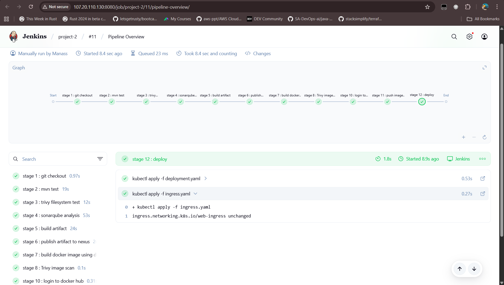
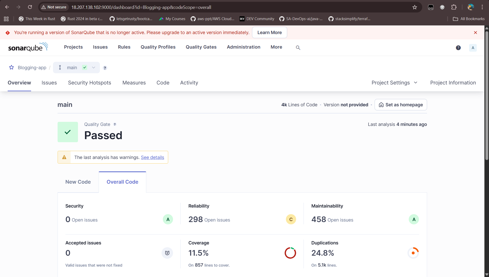
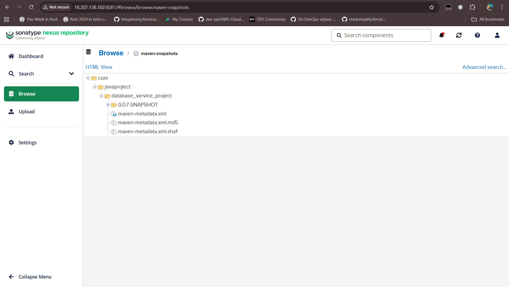
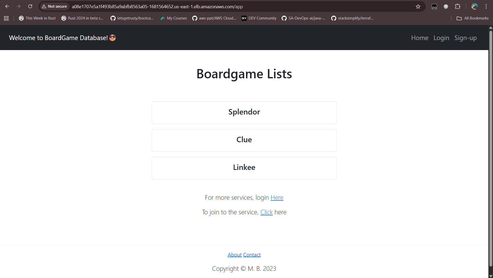

🚀 DevOps Project: CI/CD on AWS with Monitoring

This project demonstrates a complete DevOps lifecycle implementation on AWS — from infrastructure provisioning to CI/CD pipelines and monitoring with observability.

📌 Project Overview

- Provisioned AWS infrastructure using Terraform.

- Configured CI/CD pipeline with Jenkins.

- Integrated SonarQube, Nexus, DockerHub, and Trivy into pipeline.

- Deployed application to Kubernetes (EKS) with Ingress controller.

- Set up Prometheus + Grafana + Blackbox Exporter for monitoring.

⚡ Infrastructure (Terraform)

- VPC creation with networking resources.

- 4 EC2 instances:

  - Jenkins EC2

  - Monitoring EC2 (Prometheus, Grafana, Blackbox)

  - SonarQube + Nexus EC2

  - Ansible EC2 (with EKS access)

- EKS Cluster + RBAC configuration for Jenkins.

🔧 Configuration (Ansible)

- Installed Jenkins, Docker, Trivy, Maven.

- Deployed containerized SonarQube & Nexus.

- Managed dependencies and Docker installation across nodes.

🛠️ CI/CD Pipeline (Jenkins)

Pipeline Stages:

- Git Checkout (from GitHub)

- Build & Unit Test → mvn test

- Security Scan (FS) → trivy fs

- Code Quality → SonarQube analysis

- Package → mvn package

- Build Docker Image → Dockerfile

- Security Scan (Image) → trivy image

- Push Image → DockerHub

- Deploy to Kubernetes (EKS) → Deployment + Ingress

📊 Monitoring & Observability

- Blackbox Exporter → Probes application endpoints.

- Prometheus → Scrapes metrics from Blackbox + EKS.

- Grafana → Visualizes metrics in real-time dashboards.

🛠️ Tech Stack

- IAC → Terraform

- Configuration → Ansible

- CI/CD → Jenkins

- Artifact Management → Nexus

- Code Quality → SonarQube

- Containerization → Docker

- Registry → DockerHub

- Orchestration → Kubernetes (EKS)

- Security → Trivy

- Monitoring → Prometheus, Grafana, Blackbox Exporter

- Version Control → GitHub

🚀 Workflow Summary

- Developer commits code → GitHub.

- Jenkins pipeline runs → build, test, scan, package.

- Artifacts pushed → Nexus, DockerHub.

- Docker image deployed → Kubernetes (EKS).

- Monitoring → Prometheus + Grafana dashboards.

📸 Demo Screenshots

- ✅ Jenkins Pipeline Execution
  

- ✅ SonarQube Analysis Report
  

- ✅ Nexus Repository Artifact
  

- ✅ app running
  

- ✅ Grafana Dashboard

==========================================================

🚀 Project Implementation Steps

This section documents the step-by-step implementation of the project.

🔹 1. Git & AWS Setup

1. Created a Git repository for the project.

2. Created an AWS Access Key and an S3 bucket for Terraform state storage.

🔹 2. Infrastructure Provisioning (Terraform)

1. Created a VPC.

2. Provisioned 3 EC2 instances:

   - Ansible EC2 (also used for EKS access).

   - Jenkins EC2.

   - SonarQube & Nexus EC2.

3. Later created another EC2 instance for Monitoring Stack (Prometheus, Grafana, Blackbox Exporter).

4. Created Security Groups for public access to eks cluster

5. Provisioned an EKS Cluster.

🔹 3. Configuration Management (Ansible)

1. Installed Ansible on Ansible EC2 and connected other EC2 nodes.

2. Created playbooks for:

- Installing Docker.

- Installing Jenkins.

- Running Docker containers (for SonarQube & Nexus).

- Installing Trivy.

- Installing Maven.

3. Applied playbooks:

- Installed Docker on all EC2 instances.

- Installed Jenkins on Jenkins EC2.

- Deployed SonarQube & Nexus as containers on their EC2.

- Installed Trivy and Maven on Jenkins EC2.

🔹 4. SonarQube & Nexus Setup

1. Set up SonarQube in browser.

2. Installed SonarQube Scanner plugin in Jenkins.

3. Configured SonarQube server in Jenkins.

4. Set up Nexus in browser.

5. Connected Nexus to Jenkins:

- Added maven-releases repo link to project’s pom.xml.

- Installed Nexus plugin in Jenkins.

- Configured Nexus credentials in Jenkins → Managed Files.

🔹 5. Jenkins Pipeline (CI/CD)

1. Added DockerHub credentials to Jenkins.

2. Created CI/CD pipeline until artifact publishing to Nexus.

3. Created a Dockerfile for application.

4. Extended pipeline to:

- Build Docker image.

- Run Trivy image scan.

- Push Docker image to DockerHub.

5. Configured pipeline stages:

- Git checkout.

- mvn test.

- trivy fs scan.

- SonarQube analysis.

- mvn package.

- Deploy to Nexus (mvn deploy).

- Docker build & Trivy image scan.

- Push image to DockerHub.

🔹 6. EKS Configuration

1. On Ansible EC2:

- Installed AWS CLI.

- Installed kubectl.

- Configured AWS access key with CLI.

- Configured EKS cluster via CLI.

- Gave IAM user access to EKS.

2. Installed Nginx Ingress Controller on EKS.

3. Created namespace webapp

4. Created RBAC service account for Jenkins to access EKS.

5. Deployed application on EKS:

- Deployment YAML.

- ClusterIP service YAML.

- Ingress YAML.

6. Extended Jenkins pipeline with Kubernetes deployment stage.

🔹 7. Monitoring & Observability

1. Provisioned Monitoring EC2 (via Terraform).

2. Installed on Monitoring EC2:

- Blackbox Exporter.

- Prometheus.

- Grafana.

3. Configured Prometheus job to scrape webapp metrics via Blackbox Exporter.

4. Accessed Grafana in browser.

5. Created Grafana dashboards with Prometheus as datasource to visualize application metrics.

==================================================
📌 Resume Entry Example

DevOps Project – CI/CD Pipeline with AWS, Kubernetes, Monitoring
(Personal Project | GitHub Link)

- Provisioned AWS infrastructure using Terraform (VPC, EC2, Security Groups, EKS).

- Configured Ansible for automated provisioning of Jenkins, Docker, Maven, Trivy, SonarQube, and Nexus across EC2 instances.

- Designed a Jenkins CI/CD pipeline integrated with:

  - GitHub (source control).

  - Maven (build & test).

  - SonarQube (code quality analysis).

  - Trivy (filesystem & container image scanning).

  - Nexus Repository (artifact management).

  - Docker & DockerHub (containerization & image registry).

  - Kubernetes (EKS) (deployment with Ingress).

- Implemented RBAC in EKS to securely provide Jenkins cluster access.

- Installed Nginx Ingress Controller and deployed workloads in a dedicated namespace

- Built an end-to-end CI/CD pipeline: Git Checkout → Test → SonarQube → Trivy → Package → Nexus → Docker Build → Image Scan → DockerHub → Deploy to EKS.

- Set up Monitoring & Observability stack on a separate EC2:

  - Blackbox Exporter + Prometheus + Grafana to monitor application endpoints and visualize metrics.

- Outcome: Fully automated, secure, and monitored CI/CD pipeline demonstrating real-world DevOps workflows.
