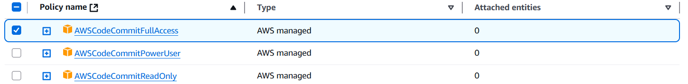
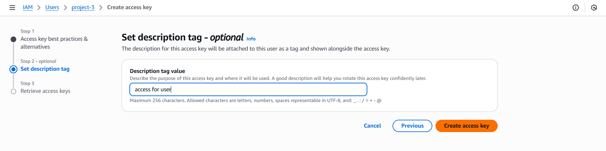

In This Project, we are Developing and Deploying a application on EKS using Docker and AWS Developers Tools.

- CodeCommit: For Source Code Management

- CodeBuild: For building and testing our code in a serverless fashion

- CodeDeploy: To deploy our code

- CodePipeline: To streamline the CI/CD pipeline

- System Manager: To store Parameters

- ECR: To store Docker Images in a Repository

- Identity and Access Management (IAM) for creating a Service Role

- S3 for artifact storing

- EKS for Deployment

Create IAM User:

- Go to the IAM console and create a user.

- Click on Create User -> User details -> Next.

- Add Permission for full access to CodeCommit.
  

- Click on Create for the user.

- create access key for user to interact with cli
  

- configure access on aws-cli

  ```aws configure

  ```
